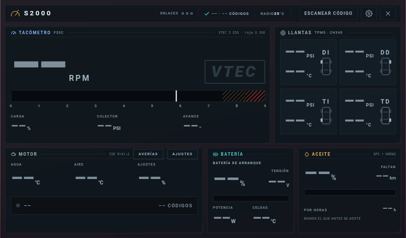
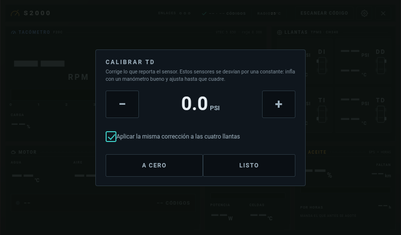
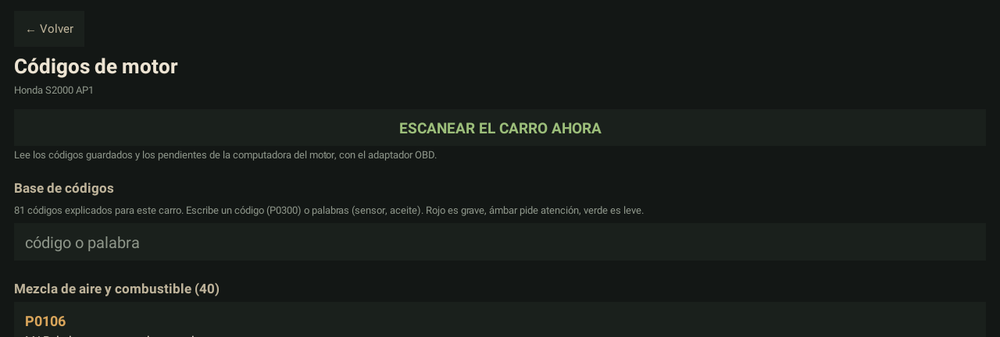
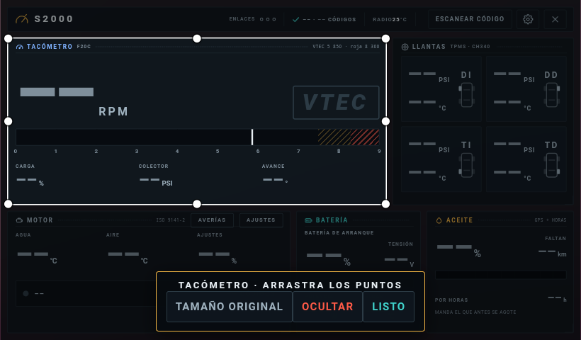
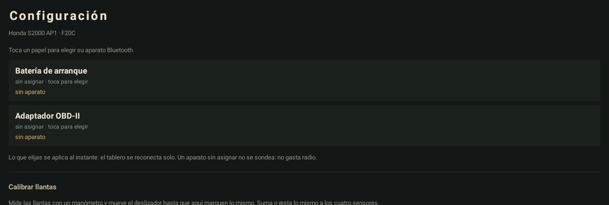

# S2000 Dash

Tablero en vivo para un **Honda S2000 AP1** (motor F20C), corriendo en el radio
Android del carro. Un tacómetro con el VTEC como acontecimiento, el motor por
OBD-II, la batería de litio por Bluetooth, la presión y temperatura de las
llantas por un receptor TPMS USB y la vida del aceite. Todo en una pantalla,
sin internet.



*El APK real corriendo en el emulador del radio, sin carro conectado: por eso
los valores salen en «––». La app nunca inventa un dato; las marcas del
tacómetro (VTEC 5 850, roja 8 300) sí salen, porque vienen del perfil del motor.*

## Qué hace

**Tacómetro.** Revoluciones en grande sobre una barra que se desliza, con la
escala del F20C: marca del VTEC a 5 850 rpm, zona de cambio desde 7 500 y zona
roja desde 8 300. Los números salen del perfil del motor, no están escritos en
el tablero. El **VTEC es un acontecimiento**: engancha arriba y con carga
(60 % o más), y cuando entra se enciende el cuadro entero. Debajo, carga,
presión del colector y avance.

**Motor (OBD-II, ISO 9141-2).** Agua, aire, ajustes de combustible y el estado
de la luz de avería con el número de códigos guardados.

**Batería de litio (BMS JBD por Bluetooth LE).** Carga, tensión, potencia con
signo y temperatura. Se lee por la radio interna o, si está enchufado, por un
dongle Bluetooth USB.

**Llantas (receptor TPMS USB, CH340).** Presión y temperatura de las cuatro.
- Calibración: un deslizador que suma o resta a los cuatro sensores, o rueda por
  rueda sosteniendo el dedo sobre su casilla.
- **Alertas configurables** de presión baja, presión alta y temperatura alta,
  contra la presión ya calibrada. Suenan como alarma aunque el tablero esté
  cerrado. Detector de pinchazo por caída rápida.



**Aceite.** Vida restante por kilómetros (GPS) y por horas de motor.

**Escanear código.** Un botón en la cabecera, junto a la tuerca: lee los códigos
guardados y los pendientes, y trae una base de **81 códigos** del F20C
explicados en español sencillo, con gravedad, causas y buscador. Un código que no
está en la base se explica por su grupo (SAE J2012).



**Cuadros a tu gusto.** Sostén el dedo sobre un cuadro: aparece un recuadro
blanco con puntos para redimensionarlo como quieras o arrastrarlo para moverlo.
Solo cambia ese cuadro, y los bordes se pegan a los de los demás.



**Pantalla dividida.** Con el mapa al lado, el tablero se vuelve un solo cuadro
con las revoluciones y el VTEC, la batería, las cuatro llantas y el motor.

**Aparatos elegidos, no escritos.** La batería y el adaptador OBD se eligen en
Ajustes, con búsqueda en vivo. Si cambias alguno, eliges el nuevo y funciona.



## Reglas que no se rompen

- **Un dato que falta o que ya es viejo se pinta «––», nunca un cero ni un
  valor por defecto.**
- **Nada se inventa**: lo que la computadora no reporta no se pinta.
- **El radio se cuida**: un guardián térmico baja el ritmo de pintado y pausa
  el Bluetooth cuando el radio se calienta.
- **Ligera**: sin AndroidX, el APK pesa unos 1,5 MB.

## Estructura

```
s2000/        la app: su perfil, su motor (F20C), el tablero HTML y la tabla
              de averías
comun/        la librería: Bluetooth, OBD, batería, llantas, tablero, ajustes,
              diagnóstico. No sabe en qué carro corre: se lo dice la app al
              arrancar (Carro.instalar)
confirmador/  APK acompañante: pulsa «Instalar» cuando la app se actualiza y
              teclea el PIN del adaptador OBD al emparejarlo, porque este
              radio no deja escribirlo. Usa un servicio de accesibilidad y solo
              actúa cuando la app se lo pide.
tools/        publicar una versión y anunciarla en la red local
```

## Construir e instalar

Requisitos: JDK 17, Android SDK 34 y Gradle 8.7. Un `local.properties` con la
ruta del SDK (`sdk.dir=...`).

```bash
gradle :comun:testDebugUnitTest :s2000:testDebugUnitTest :confirmador:testDebugUnitTest
gradle :s2000:assembleRelease :confirmador:assembleRelease
adb install -r s2000/build/outputs/apk/release/s2000-release.apk
```

Los APK de release se firman con el keystore de depuración de la máquina, que
no va en el repositorio. La auto-actualización y el confirmador solo funcionan
entre APK firmados con el mismo certificado.

## Actualizar el radio por la red

```bash
tools/publicar.sh
python -m http.server 8000 -d build/publicar
python tools/anunciador.py
```

## Licencia

MIT. Ver [LICENSE](LICENSE).
